# Instalación y configuración en un servidor debian

[1.Introduccion](#Introduccion)  
[2.Configuracion de la ip](#Configuraciondelaip)  
[3.Instalacion del servidor](#Configuraciondelservidor)  
[4.Configuracion de la tarjeta que escucha](#Configuraciontarjeta)  
[5.Ejemplo práctico](#Ejemplopráctico)  
[6.Si no funciona](#syslog)

1. Introduccion  
Este es un documento realizado con el fin de hacer una configuracion de un servidor en debian .
2. Configuracion de la ip  
Para configurar la ip de el servidor tendremos que ir a configuración y a red, nos metemos dentro de la tarjeta de red y le asignamos a mano la ip, puerta de enlace, DNS y la puerta de enlace
3. Instalacion de un servidor  
Para la instalación del servidor usaremos el siguiente comando  
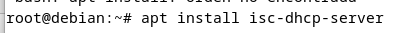  
4. Configuración de una tarjeta  
 Una vez instalados los paquetes modificaremos el fichero dhcp.conf para modificar la tarjeta que escucha
5. Ejemplo práctico  
5.1 Configuramos la tarjeta de red con la ip , mascara, puerta de enlace y dns que tenemos que poner en la maquina de debian 
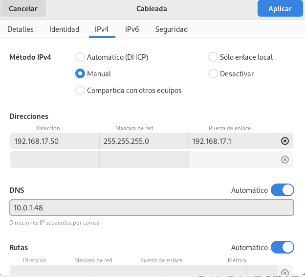
5.2 Instalamos el paquete necesario para la configuración  
  
5.3Ahora comprobamos, hacemos una copia y despues configuramos el fichero dhcp.conf:  
 Aqui compruebo que lo tenemos 
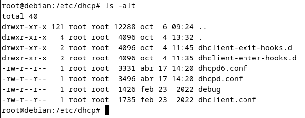  
Aqui le hago la copia.  
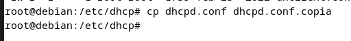  
 Aqui lo edito mediante el comando nano dhcpd.conf  
En esta primera captura ponemos el nombre del server, los dns y el lease time:
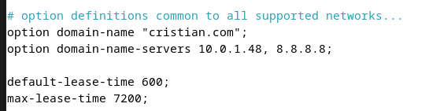  
En esta segunda captura ponemos la ip de nuestra red y los rangos y exclusiones que queremos poner 
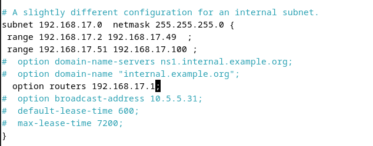  
Aqui ponemos la direccion mac de la red interna y la ip reservada para nuestro cliente ubuntu
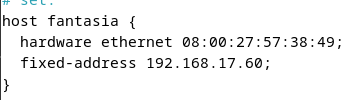  
5.4 Aqui compruebo que el servidor esta ya activado  
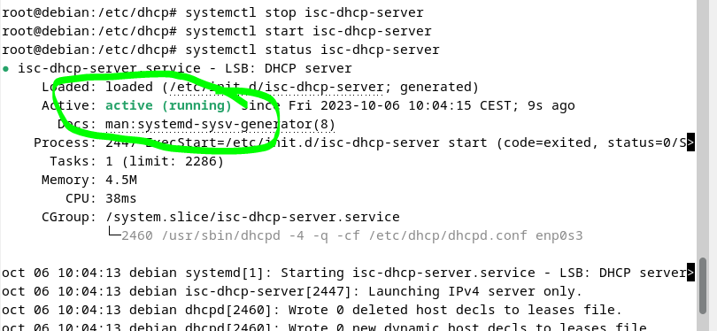  
5.5  
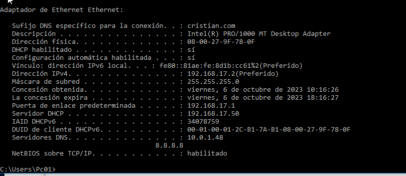
5.6 Aqui compruebo que se ha asignado la ip correctamente
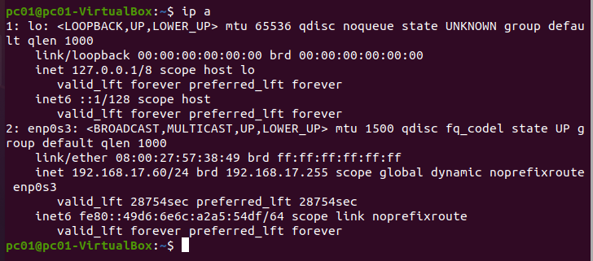  

6. syslog  
6.1  Instalamos el paquete  
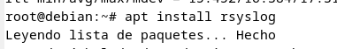  
6.2  
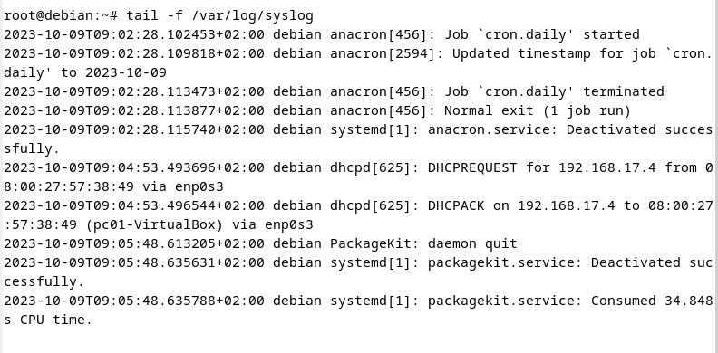  
6.3  Le hacemos el grep
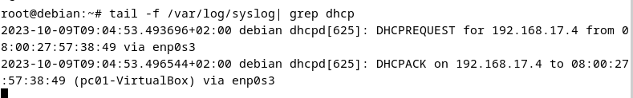  
6.4  Reiniciciamos el servicio isc-dhcp-server.service
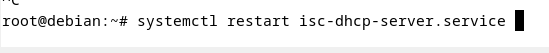

